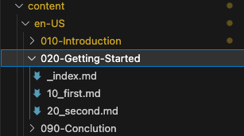
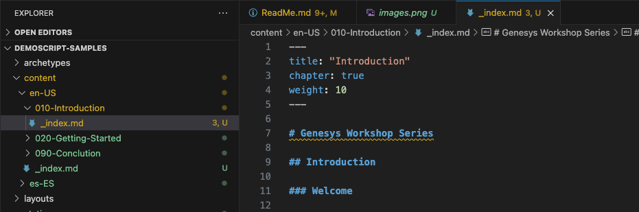
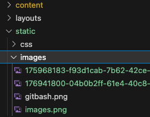

# Welcome to the Genesys Demo Script template repository

The purpose of this repository is to provide a guidance on how to create a Demo Script.

## Repository Structure
```
genesys-workshop-template
├───.github
│   └───workflows
├───archetypes
├───content
│   ├───en-US
│   │   ├───010-Introduction
│   │   ├───020-Getting-Started
│   │   └───090-Conclusion
│   └───es-ES
│       ├───010-Introduction
│       ├───020-Getting-Started
│       └───090-Conclusion
├───layouts
│   └───partials
├───resources
│   └───_gen
│       ├───assets
│       └───images
├───static
│   ├───css
│   └───images
└───themes
    └───hugo-theme-learn
 ```

## How to Contribute

### Content and Structure

You should work with "Content" folder seen in the repository structure above. Place your images to the "static/images" folder. You can think of the folders within "Content" as modules. For example, if you wanted to add a module about "Setting Up", you would add a folder to the "Content folder" and title it "030-Setting Up". You would then add your information to that module. The number before the title signifies the order of that module. So "030-Setting Up" would come after "020-Getting Started" and before "090-Conclusion".

You can then organize your content within that folder by adding [markdown](https://www.markdownguide.org/basic-syntax) files. To add a markdown file, right click the folder you want this file to appear in and select "New File". Give the submodule a title that reflects its numerical order followed by ".md". For example, if you wanted the module "020-Getting Started" to have 2 "submodules", you would title the first one  "10_first.md" and the second one "20_second.md". (Note: files have to end in ".md" for the system to recognize it as a markdown file).



To add information to your module's landing page, you can edit the "index.md" file. For example, if I wanted my "030-Setting Up" landing page to have an objective, welcome, etc, I would add that to the "index.md" file.



### Title

"Title" in an md file header will be shown as a name of the branch in the Demo Script navigation tree.

```
---
title: "Introduction"
chapter: true
weight: 10
---
...
```

### Images

Images can be added to the "Images" subfolder under the "Static" folder. Once the images are uploaded to this folder, you can begin referencing them using markdown language.



### Thumbnail

Add a special image with filename '*thumbnail.png*' to show it on the Demo Script tile in GDemo. The size of image should be **80x80 px**. It is shown on a tile as a circle with 80px diameter.

For advanced formatting features refer to *Short codes* and *Placeholders* (see Below).

## Languages  

Each language content should be placed under a special folder under 'content' directory. The folder have must be be same as language code, like 'en-US' or 'pr-PR'. The structure of language folders is simalar, the only difference is translated md files. 

Images for different languages can be the same or different. In the second case they should be placed to static/images folder with new names, like '*popup.png*' and '*es-popup.png*'.

### Adding a new language

To add a new language:

- copy content of 'content/en-US' folder
- translate md files in the copy
- put translated files under 'content/[localization code]' folder
- update config.toml file with new language section, like for 'es-ES':

```
[Languages.es]
contentDir = 'content/es-ES'
title = "Serie de talleres Genesys"
description = "En este taller, aprenderá cómo crear un taller desde cero usando Github y algunas otras herramientas"
weight = 2
languageName = "Español"
languageCode = "es-ES"
```

Send updated files to tm@genesys.com

## Demo scripts content

You should use [markdown language](https://www.markdownguide.org/basic-syntax/) to format text in your files.  

### Images

Add images in markdown format pointing to 'images' folder:

```

```

Here is an example of linking image:

```
[](http://genesys.com)
```

### Short codes

Youtube frame (use video id):
```

```

Vimeo frame (use video id):
```

```

Mp4 video frame:
```

```

Warning notice:
```
{}
Some important warning text is here....
{}
```

Info notice:
```
{}
Some information is here....
{}
```

Note notice:
```
{}
Some notes are here....
{}
```

Tip notice:
```
{}
Some interesting tip is here....
{}
```

Collapsible info block:
```
{{% collapse info title="...." }}%
Some interesting tip is here....
{}
```

Collapsible warning block:
```
{{% collapse warning title="...." }}%
Some warning is here.... 
{}
```

### Placeholders

Placeholder allow you adding to your script some dynamic informatio, like first or last name of the GDemo logged in user, his email address, etc:

| Placeholder | Replacement |
|--- | --- |
| #gsys_username | GDemo username |
| #gsys_firstname | First name |
| #gsys_lastname | Last name |
| #gsys_gdemo_id | GDemo ID |
| #gsys_email | Email address |
| #gsys_phone | Phone number |
| #gsys_address | Address |
| #gsys_city | City |
| #gsys_country | Country |
| #gsys_pc_region | GC Region |
| #gsys_pc_skill1 | GC Skill 1 |
| #gsys_pc_skill2 | GC Skill 2 |
| #gsys_ext_contact | GC External contact ID |

***Example:***

```
Make a call from #gsys_phone phone number.
```

